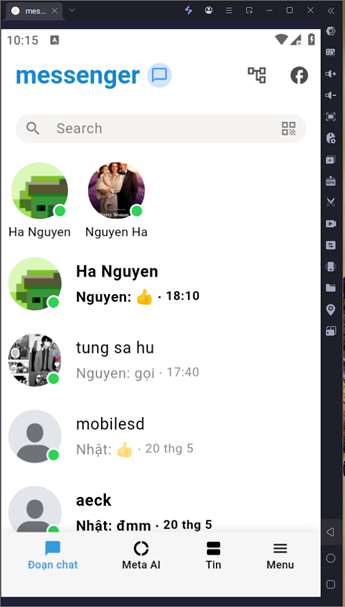
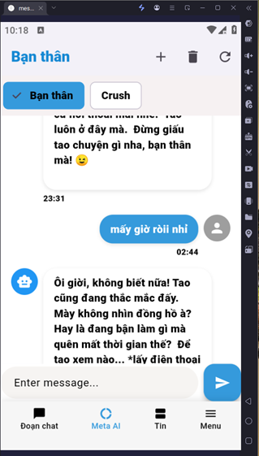
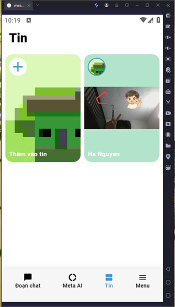
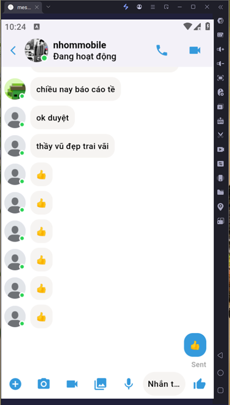
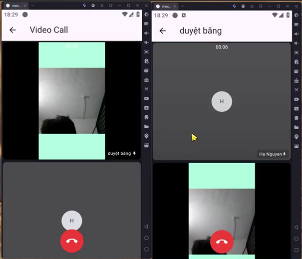

# Messenger Clone

A modern messaging application built with Flutter, featuring real-time chat, video calls, and more.

## Features

- 💬 Real-time messaging
- 📞 Video and audio calls
- 📸 Image and video sharing
- 🔔 Push notifications
- 🔒 Secure authentication
- 💾 Local storage
- 🌐 Cross-platform support

## Screenshots

  
  
  
  
  
 
[](https://drive.google.com/drive/folders/1Za7tzsPghMiUbhfunv1jIfZL3whDdk5k?fbclid=IwY2xjawK7QgpleHRuA2FlbQIxMQABHuzj4MWeE5kLy-B_wyQeTcKqXJwdG9nKNAOW78S2ts5tUTlFdOPg58PJ-ECi_aem_Eu32XxNyCOk_XGqCf4WWxQ)

## Tech Stack

- **Frontend**: Flutter/Dart
- **State Management**: BLoC Pattern
- **Backend Services**: 
  - Firebase (Authentication, Cloud Messaging)
  - Appwrite (Backend as a Service)
- **Video Calling**: Zego Cloud
- **Local Storage**: Hive
- **Push Notifications**: Firebase Cloud Messaging

## Getting Started

### Prerequisites

- Flutter SDK (^3.7.0)
- Dart SDK
- Android Studio / VS Code
- Firebase account
- Zego Cloud account
- Appwrite account

### Installation

1. Clone the repository:
```bash
git clone https://github.com/your-username/messenger_clone.git
```

2. Install dependencies:
```bash
flutter pub get
```

3. Configure Firebase:
   - Create a new Firebase project
   - Add your `google-services.json` to `android/app`
   - Add your `GoogleService-Info.plist` to `ios/Runner`

4. Configure Zego Cloud:
   - Create a new project in Zego Cloud
   - Add your AppID and AppSign to the configuration

5. Configure Appwrite:
   - Create a new Appwrite project
   - Set up your database and storage
   - Add your configuration to the app

6. Run the app:
```bash
flutter run
```

## Project Structure

```
lib/
├── common/           # Common widgets and utilities
├── features/         # Feature-based modules
│   ├── auth/        # Authentication
│   ├── chat/        # Chat functionality
│   ├── call/        # Video/audio calls
│   └── profile/     # User profile
└── main.dart        # Entry point
```

## Contributing

1. Fork the repository
2. Create your feature branch (`git checkout -b feature/AmazingFeature`)
3. Commit your changes (`git commit -m 'Add some AmazingFeature'`)
4. Push to the branch (`git push origin feature/AmazingFeature`)
5. Open a Pull Request

## License

This project is licensed under the MIT License - see the [LICENSE](LICENSE) file for details.

## Acknowledgments

- Flutter team for the amazing framework
- Firebase for backend services
- Zego Cloud for video calling capabilities
- Appwrite for backend as a service
